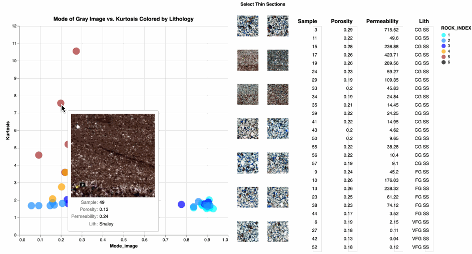
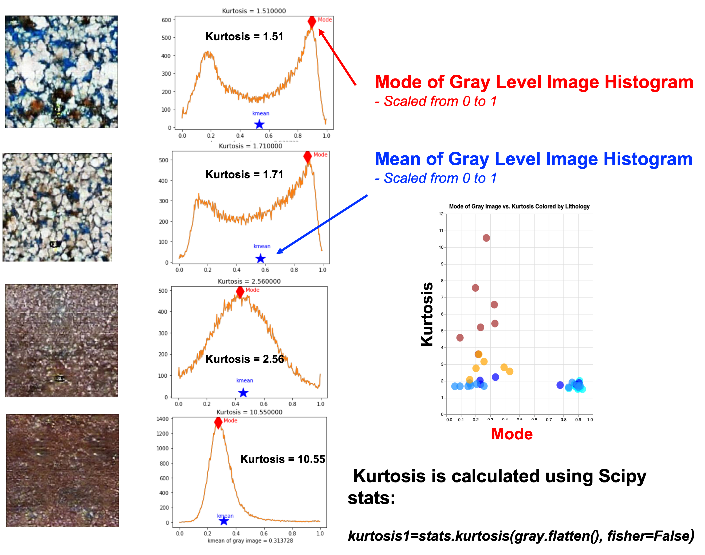

# Altair-Used-to-Evaluate-Core-Data-Showing-Thin-Section-Photomicrographs-for-Selected-Samples
We are using python Altair to evaluate Core Data showing the Thin Section photomicrographs for our select samples.

>

Much o the data used in these Jupyter Notebook examples are from our analsis of the Thin Section images at the gray-level, scaled from 0 to 1. The gray level histograms are almost like T2 distributions. The shaley rock is at the low end of the gray-scale histogram, and the quartz grains are at the high level of the histogram. It is apparent that you can almost rock type just from the gray-level histograms alone in this formation. 

>
