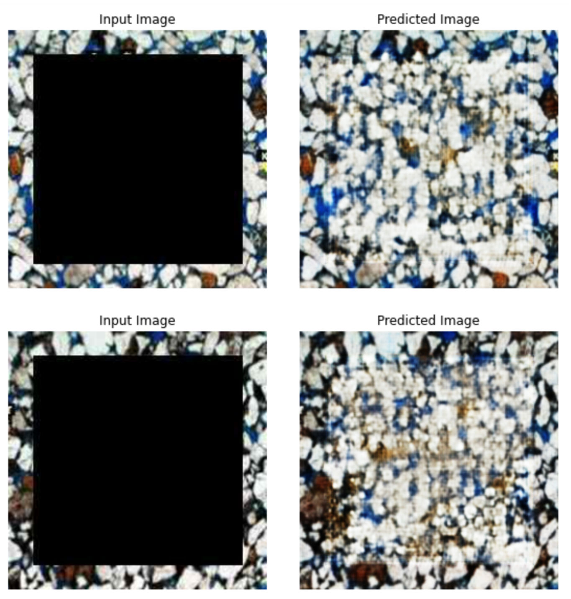
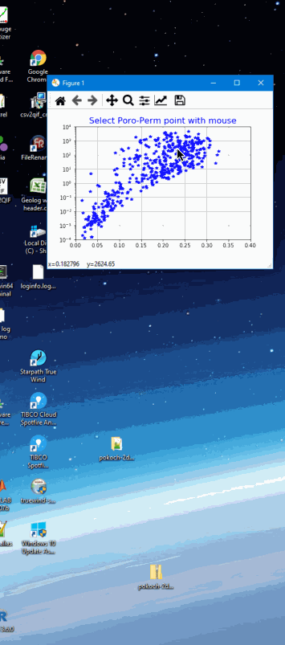

# Altair-Used-to-Evaluate-Core-Data-Showing-Thin-Section-Photomicrographs-for-Selected-Samples
We are using python's Altair to evaluate Core Data to better understand the texture of the rock by showing the Thin Section photomicrographs for each of our select samples from petrophysical cross plots. 

>

Much o the data used in this Jupyter Notebook example are from our analysis of the Thin Section images at the gray-level, scaled from 0 to 1. The gray level histograms are almost like T2 distributions. The shaley rock is at the low end of the gray-scale histogram, and the quartz grains are at the upper level of the histogram. It is apparent that you can almost rock type just from the gray-level histograms alone in this formation. 

>

By the way, the thin sections used in this example do not exist in real life. They are predicted using conditional GANS pix2pix from tensorflow. Please consider this work in progress. They are good enough to demonstrate these new features in Altair, but we have a long way to go in the creation of realistic thin section images. This will be the subject of our next repository after we evolve our techniques. 

There are websites that show GAN generated people that do not exist in real life. They have 1,000's of images used in training while we have just over 50 thin sections. We have tried augmentation using flips, dips, jitter and mirror images, but we need more data; all at the same magnification. We have a long way to go in the creation of totally realistic looking thin section photomicrographs, but this is a start. More to come on this subject in the near future. 

Our goal is to use a training image as shown below which are the thin section image pixels forming just the boarder to give the program some idea as to the texture of the rock, and then predict a proper thin section photomicrograph. Please find below one of our first attempts at this process:

>

The conditional GANs does appear to be using the edge pixels for texture, but there are also some process artifacts shown in the area of the black box used in the testing. We are training the data on the real images, but we use the black box image for our prediction. We want to see how well the program handles this black box region. Since this initial attempt, we have used augmentation to supplement our dataset, and the results are better. We have also created separate training sets by lithologic description with much better results too. This might be our final solution in the end to first provide a lithologic description before any predictions. 

Our goal will be to select any poro-perm combination and using ML create a representative thin section image showing the texture and a capillary pressure curve. 

A kNN example is shown below.  We are using kNN to query our petrophysical database to find the nearest samples to our poro-perm combination and then produce the results as shown in this example below:

>

Our final product might require the user to provide a lithologic description of the rock first and then select the poro-perm combination where the program would provide a final prediction of a thin section image and a capillary pressure curve that is fit for that texture.
